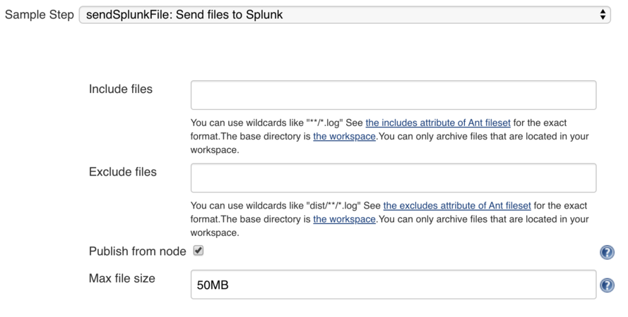
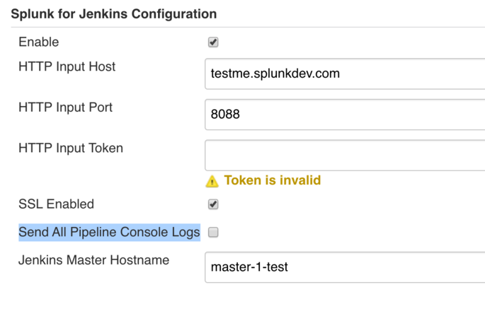

## A component of Splunk Plugin for Jenkins to support pipeline jobs

### Provided steps
- sendSplunkFile
```
sendSplunkFile includes: "*.log", sizeLimit: "50MB"
``` 



- sendSplunkConsoleLog

since version 1.9.0, the plugin is able to capture all pipeline log via [TaskListenerDecorator](https://javadoc.jenkins.io/plugin/workflow-api/org/jenkinsci/plugins/workflow/log/TaskListenerDecorator.html)



sendSplunkConsoleLog step is only required when the global option is not checked

```
#scripted pipeline
sendSplunkConsoleLog {
  node{
    sh "echo testjob";
 }
}

#declarative pipeline
pipeline {
    agent any
    options {
        timeout(time: 1, unit: 'HOURS')
        sendSplunkConsoleLog()
    }
    stages {
        stage('Example') {
            steps {
                echo 'Hello World'
            }
        }
    }
}
```


## Change Log
Located in the [CHANGELOG.md](CHANGELOG.md)